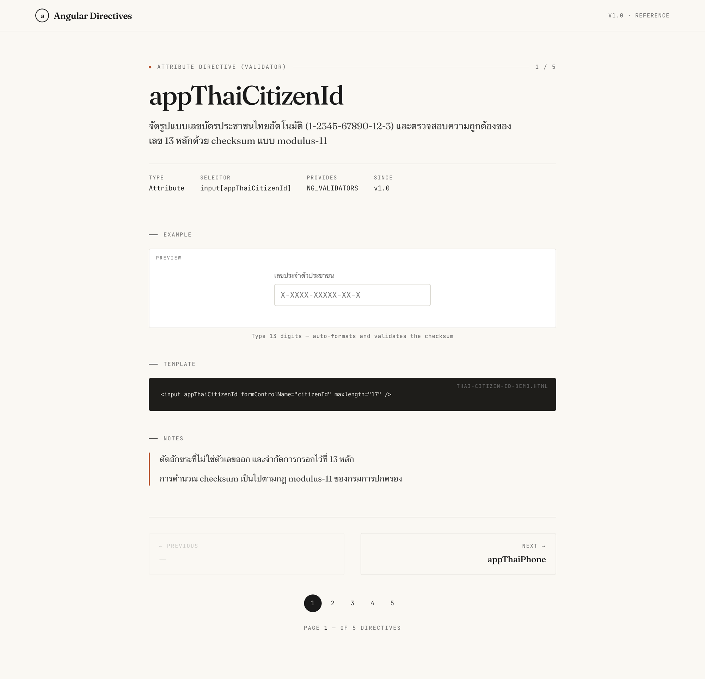

# Angular Custom Pipe Example

เว็บไซต์เอกสาร/ตัวอย่างการใช้งาน **Custom Directives** ของ Angular สร้างด้วย
**Angular 21** — ใช้ standalone components, signals และ control-flow block `@for`
ผ่าน builder ตัวใหม่ `@angular/build` (esbuild/Vite) พร้อม Bootstrap 5 และ Bootstrap Icons

ภายในรวมตัวอย่าง custom directive ที่ใช้งานจริง เช่น `thaiCurrency`, `thaiPhone`,
`thaiCitizenId` และ `debounceClick` พร้อมหน้า docs ที่แสดงโค้ด ตัวอย่าง และคำอธิบายของแต่ละตัว

## ตัวอย่างหน้าจอ (Screenshot)



หน้า docs จะแสดงรายละเอียดของแต่ละ directive — ทั้ง type, selector, ตัวอย่างโค้ด,
ส่วน preview ที่ลองพิมพ์ได้จริง และหมายเหตุการใช้งาน

---

## ความต้องการของระบบ (Requirements)

โปรเจคนี้รันบน **Node.js 24** และ **Angular 21**

| เครื่องมือ | เวอร์ชัน |
|-----------|---------|
| **Node.js** | `24` |
| **npm** | `>=8` (โปรเจคนี้ใช้ `npm@11.13.0`) |

---

## ขั้นตอนการติดตั้ง (Installation)

ติดตั้ง dependencies:
```bash
npm install
```

> ไม่จำเป็นต้องติดตั้ง Angular CLI แบบ global — โปรเจคนี้มี `@angular/cli`
> อยู่ใน devDependencies แล้ว เรียกใช้ผ่าน `npm run ...` ได้เลย

---

## ขั้นตอนการรันโปรเจค (Run)

### รันแบบ development (มี hot-reload)
```bash
npm start
```
แล้วเปิดเบราว์เซอร์ไปที่ **http://localhost:4200**
ทุกครั้งที่แก้ไฟล์ในโฟลเดอร์ `src/` หน้าเว็บจะ reload ให้อัตโนมัติ

---

## คำสั่งอื่น ๆ ที่ใช้บ่อย

| คำสั่ง | หน้าที่ |
|--------|---------|
| `npm start` | รัน dev server (`ng serve`) ที่ port 4200 |
| `npm run build` | build เวอร์ชัน production ออกไปที่โฟลเดอร์ `dist/` |
| `npm run watch` | build แบบ development พร้อม watch ไฟล์ |
| `npm test` | รัน unit test ด้วย **Vitest** |

---

## โครงสร้างโปรเจคโดยย่อ

```
src/
├── app/                      # root component + app config
├── features/
│   └── directive-docs/       # หน้าหลัก: เอกสาร Angular directives
│       ├── components/       # ส่วนประกอบย่อย (code-block, top-bar, ฯลฯ)
│       ├── data-access/      # การเข้าถึงข้อมูล
│       ├── demos/            # ตัวอย่างการใช้งาน directive
│       └── models/           # type / interface
├── shared/                   # โค้ดที่ใช้ร่วมกัน
├── assets/                   # ไฟล์ static
├── styles.scss               # global styles
└── main.ts                   # จุดเริ่มต้นของแอป
```
